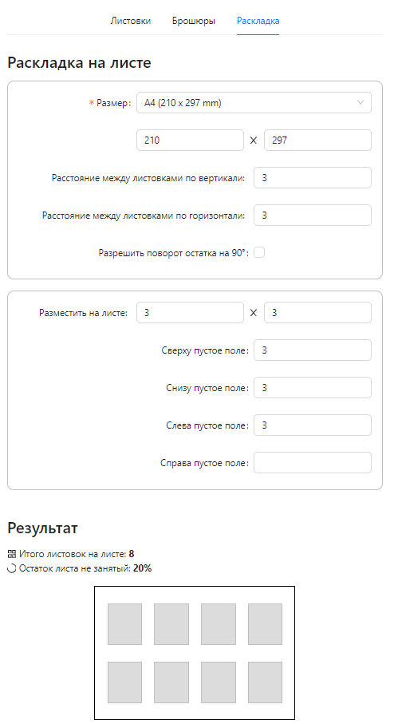

# Раскладка на листе

## Размер - поле со списком

Данные хранятся в Стандартных форматах {"Название", ширина, длина}

productWidth = detailWidth = ширина,

productLength = detailLength = длина

Набор данных:

- {"A6 (105 x 148 mm)", 105, 148}
- {"A5 (148 x 210 mm)", 148, 210}
- {"A4 (210 x 297 mm)", 210, 297} - default
- {"A3 (297 x 420 mm)", 297, 420}
- {"140 x 200 mm", 140, 200}

## Расстояние между листовками

gapX, gapY
Ограничения на данные - целое число >= 0 или <= 100

## Разрешить поворот остатка на 90

isRotated = false по умолчанию

## Разместить на листе

bigSheetX, bigSheetY

## Пустые поля

marginLeft, marginRight, marginUp, marginDown

Нажимаем посчитать.
Вызываем функцию (она уже есть на php) Impossition (bigSheetX, bigSheetY, detailWidth, detailLength, gapX, gapY, marginLeft, marginRight, marginUp, marginDown, isRotate) и получаем сколько листовок на большом листе помещается = itemsTotal. Если itemsTotal = 0, то не помещается в коробку.

Impossition должна возвращать к-во изделий по горизонтали - itemsX, вертикали - itemsY, повернуто - itemsRotated.
Общее к-во изделий itemsTotal = itemsX * itemsY + itemsRotated
Сейчас для всех случаев принимаем itemsX = 3, itemsY =2, itemsRotated = 1.

Отрисовать это прямоугольниками в UI.

Остаток листа не занятый = itemsTotal * detailWidth * detailLength /(bigSheetX * bigSheetY);

