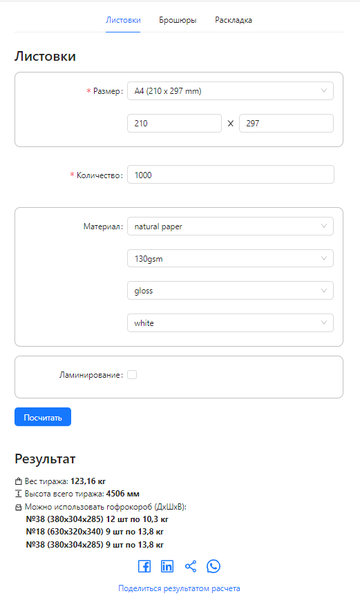

# Листовки
1. В результатах показать вес в кг и два знака после запятой
```
Result.jsx <span style={{ fontWeight: "bold" }}>{productionWeight} кг</span>
```
2. Ошибка в formulas.js:
const calcLaminateThickness = (laminationSides, filmThicknessMicron) =>
  laminationSides * filmThicknessMicron / 1000;
3. Нет в результатах короба Box.js name: "№8". Возможно ли добавлять данные в файл data?
4. Вывод в результатах коробок это целое число, вес в формате 0.00 кг
Можно использовать гофрокороб (ДхШхВ):
№18 (630x320x340) 1 шт по 22.03 кг


## Размер - поле со списком

Данные хранятся в Стандартных форматах {"Название", ширина, длина}

productWidth = detailWidth = ширина,

productLength = detailLength = длина

Набор данных:

- {"A6 (105 x 148 mm)", 105, 148}
- {"A5 (148 x 210 mm)", 148, 210}
- {"A4 (210 x 297 mm)", 210, 297} - default
- {"A3 (297 x 420 mm)", 297, 420}

## Поля с размером детали

Данные подставляем из Стандартных форматов в зависимости от выбора в поле размер.
Можно ввести свои данные, тогда поле размер будет пустым и серым.
Ограничения на данные - целое число >= 1 или <= 10000

## Количество - количество листовок

quantity - Количество деталей = кол-во листовок. Деталь меняет вес и толщина в зависимости от ламинации.
Количество - целое число >= 1 или <= 100_000

## Материал

Материал на котором печатают (бумага, картон, пленка) materialMedia
```json
 {
    "mediaName": "меловка матовая", // название материала (показать в UI)
    "mediaOneSheetCost": 15.06, // цена руб за лист
    "mediaWeigthGramsSqMeter": 170, // вес кв метра листа в граммах (показать в UI)
    "mediaTexture": "матовая", // текстура материала (показать в UI)
    "mediaColor": "белый", // цвет материала (показать в UI)
    "mediaThicknessMillimeters": 0.12, // толщина листа в мм
    "mediaLength": 940,    // длина листа mm
    "medialWidth": 620,   // ширина листа mm
  }
```

Набор данных:

```txt
materialMedia: {
    id: 1
    mediaName: "меловка матовая",
    mediaOneSheetCost: 16.72,
    mediaWeigthGramsSqMeter: 170,
    mediaTexture: "матовая",
    mediaColor: "белый",
    mediaThicknessMillimeters: 0.13,
    mediaLength: 900,  
    medialWidth: 640
  }
materialMedia: {
    id: 2
    mediaName: "меловка глянцевая",
    mediaOneSheetCost: 16.72,
    mediaWeigthGramsSqMeter: 170,
    mediaTexture: "глянцевая",
    mediaColor: "белый",
    mediaThicknessMillimeters: 0.12,
    mediaLength: 900,  
    medialWidth: 640
  }
materialMedia: {
    id: 3
    mediaName: "офсетная",
    mediaOneSheetCost: 7.56,
    mediaWeigthGramsSqMeter: 80,
    mediaTexture: "офсетная",
    mediaColor: "белый",
    mediaThicknessMillimeters: 0.1,
    mediaLength: 1000,  
    medialWidth: 700
  }
materialMedia: {
    id: 4,
    mediaName: "картон",
    mediaOneSheetCost: 46.31,
    mediaWeigthGramsSqMeter: 320,
    mediaTexture: "двухсторонний",
    mediaColor: "белый",
    mediaThicknessMillimeters: 0.4,
    mediaLength: 1000,  
    medialWidth: 700
  }

```
## Ламинация

Выбрать одна или две стороны ламинировать
laminationSides: number // 1 или 2 стороны надо заламинировать

Выбрать материал:
```json
MaterialLaminate = {
    id // получаем из артикула материала
    filmOneMeterCost: number // цена
    filmThicknessMicron: number  // Толщина ламината мкм (показать в UI)
    filmTexture: "глянцевый", (показать в UI)
    filmLengthRoll: number // Длина намотки ламината в рулоне метров
    filmWidthRoll: number // Ширина рулона ламината в мм
    filmWeigthRollKg: number  // вес рулона ламината в кг
}
```

Набор данных:

```json
MaterialLaminate = {
    id: 1,
    filmOneMeterCost: 9,
    filmThicknessMicron: 30,
    filmTexture: "глянцевый",
    filmLengthRoll: 3000,
    filmWidthRoll: 500,
    filmWeigthRollKg: 50
}
MaterialLaminate = {
    id: 2,
    filmOneMeterCost: 35,
    filmThicknessMicron: 75,
    filmTexture: "глянцевый",
    filmLengthRoll: 1000,
    filmWidthRoll: 330,
    filmWeigthRollKg: 17
}
```

После заполнения полей сделать расчет по нажатию кнопки и вывести результат в нижней части формы. При вводе в любое поле данных сбросить вывод с результатами расчета.

Расчет веса:

- вес тиража бумаги = quantity * mediaWeigthGramsSqMeter * detailWidth * detailLength / 1e6  // грамм;
- вес одно кв м ламината = 1e6 * weigthFilmRollKg / (lengthFilmRoll * widthFilmRoll)  // грамм;
- вес ламината = quantity * laminationSides * вес одно кв м ламината * detailWidth * detailLength / 1e6 // грамм;
- Вес тиража = вес тиража бумаги + вес ламината;

Расчет высоты:

- толщина бумаги = mediaThicknessMillimeters;
- толщина ламината = laminationSides * filmThicknessMicron * 1000;
- высота тиража productionHeigthTotal = quantity * (толщина бумаги + толщина ламината); mm

Сколько коробок надо:

Вызываем функцию (она уже есть на php сюда ее перенсоить не будем, используем заглушку) Impossition (boxWidth, boxLength, detailWidth, detailLength, gapX, gapY, marginLeft, marginRight, marginUp, marginDown, isRotate) и получаем сколько листовок по площади дна коробки помещается = itemsTotal. Если itemsTotal = 0, то не помещается в коробку.

Impossition должна возвращать к-во изделий по горизонтали - itemsX, вертикали - itemsY, повернуто - itemsRotated.
Общее к-во изделий itemsTotal = itemsX * itemsY + itemsRotated
Сейчас для всех случаев принимаем itemsX = 2, itemsY = 1, itemsRotated = 0, gapX = 0, gapY = 0.

- boxWidth, boxLength, boxHeigth размеры коробоки
- detailWidth, detailLength размеры листа
- boxMarginX, boxMarginY отступы с каждой стороны внутри коробки marginX = 5, marginY = 5

Считаем высоту тиража и делим на кол-во листов на дне, делим полученнную высоту еще на высоту коробки, получаем сколько коробок надо.
nBoxes = (productionHeigthTotal / itemsTotal) / boxHeigth

? Показать % заполнения всех коробок, сколько пустого места.

Набор данных для коробок:

```json
box = {
    id: 1,
    boxName: №38,
    boxWidth: 380,
    boxLength: 304,
    boxHeigth: 285,
    boxCost: 29
}
box = {
    id: 2,
    boxName: №18,
    boxWidth: 630,
    boxLength: 320,
    boxHeigth: 340,
    boxCost: 44
}
```

Пример расчета ламината [расчет ламинации](../../src/processes/ProcessLamination.ts)

